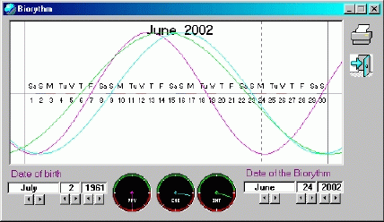



## BioRhythm\(English\)

### Description

It is a repost cause it as been deleted by an hacker a little while ago.

Biorhythms are cycles in one's life, consisting of physical, emotional and intellectual fluctuations.

The first biorhythm is the Physical. It cycles every 23 days.

The second biorhythm is the Emotional. It has a 28-day cycle.

The third biorhythm is the Intellectual. It has a 33 day cycle.

The three biorhythms begin in the positive phase at the moment of birth and continue regularily thoughout life. Each rhythm consists of low, critical and high days. Critical days are often times when a person's behavior and actions differ from the norm for the individual.
 
### More Info
 

             |
---                |---
**Submitted On**   |2002-06-24 17:22:54
**By**             |[Les Productions UnderDog](https://github.com/Planet-Source-Code/PSCIndex/blob/master/ByAuthor/les-productions-underdog.md)
**Level**          |Advanced
**User Rating**    |4.7 (14 globes from 3 users)
**Compatibility**  |VB 4\.0 \(32\-bit\), VB 5\.0, VB 6\.0
**Category**       |[Complete Applications](https://github.com/Planet-Source-Code/PSCIndex/blob/master/ByCategory/complete-applications__1-27.md)
**World**          |[Visual Basic](https://github.com/Planet-Source-Code/PSCIndex/blob/master/ByWorld/visual-basic.md)
**Archive File**   |[BioRhythm\(983076242002\.zip](https://github.com/Planet-Source-Code/les-productions-underdog-biorhythm-english__1-36206/archive/master.zip)

